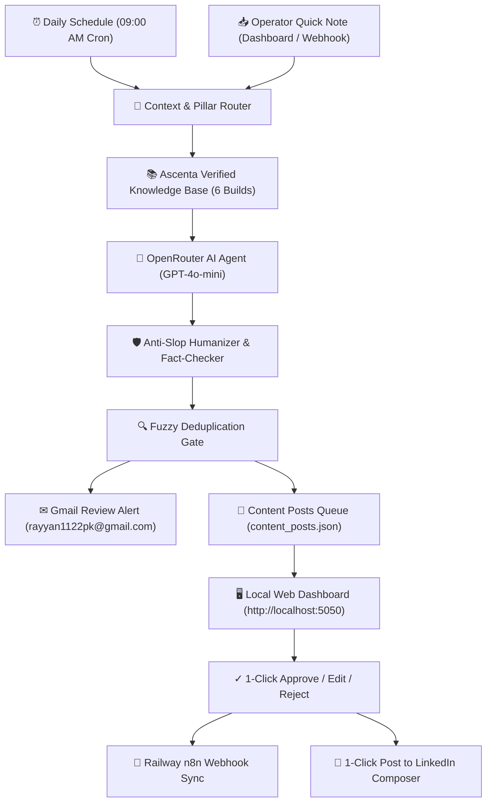

# 🚀 Ascenta — Autonomous LinkedIn Personal Brand Content Agent
### For **Muhammad Rayyan** | Founder, [Ascenta](https://ascenta-agency.vercel.app) | [linkedin.com/in/ascenta](https://www.linkedin.com/in/ascenta)

---

## 📌 Executive Overview
This is a production-grade, end-to-end autonomous LinkedIn Content System engineered specifically for **Muhammad Rayyan**. Unlike generic GPT wrappers that hallucinate fake case studies and churn out corporate buzzwords ("delve", "streamline", "game changer"), this system:
1. **Understands Muhammad's Real Experience**: Strictly grounded in 6 audited engineering builds (CleanData AI, Instagram Multimodal CRM, LeadPulse CRM, Misaal Foundation, WhatsApp CRM, Twilio Voice Agent).
2. **Operates Autonomously**: Executes on **Railway n8n** on a daily cron (09:00 AM), selects strategic content pillars, drafts high-converting posts, audits against anti-slop rules, fact-checks against verified records, and sends human-in-the-loop review alerts via Gmail.
3. **Offers a Local & Cloud Control Center**: Live interactive Web Dashboard running on `http://localhost:5050` with 1-click approvals, inline editing, "What happened today?" operator note capture, and 1-click LinkedIn post publishing.

---

## 🛠 Architecture & Tech Stack



---

## 🌐 Live System Credentials & Endpoints

| Component | Target / Value | Status |
| :--- | :--- | :--- |
| **Railway n8n Instance** | `https://primary-production-675a3.up.railway.app` | ✅ Live & Operational |
| **Active Workflow Name** | `Muhammad Rayyan — Autonomous LinkedIn Content Agent` | ✅ Active |
| **Workflow ID** | `Zlf4xBioZKJTTZyH` | ✅ Active |
| **Webhook Endpoint** | `https://primary-production-675a3.up.railway.app/webhook/linkedin-content-agent` | ✅ 200 OK Verified |
| **Model Engine** | OpenRouter (`openai/gpt-4o-mini`) via LangChain Agent | ✅ Connected |
| **Gmail OAuth2** | `rayyan1122pk@gmail.com` | ✅ Connected |
| **Local Web Dashboard** | `http://localhost:5050` | ✅ Running Live |

---

## 📂 System Directory Structure

```
d:\Claude code\linkedin-content-agent\
├── agent_core.py                 # Core Python engine: humanizer, fact-checker, calendar, note ingest
├── dashboard.py                  # High-performance threaded web dashboard UI & REST API
├── build_and_deploy_n8n_agent.py # Automated workflow builder & Railway n8n deployer script
├── data/
│   ├── knowledge_base.json       # 6 verified Ascenta projects with real problems, architectures & lessons
│   ├── voice_profile.json        # 7-step founder tone, 4 hook formulas, forbidden buzzwords list
│   ├── content_pillars.json      # 8 permanent strategic content pillars mapped to target audience
│   ├── content_posts.json        # Dynamic post queue (Ready for Review, Approved, Published)
│   └── quick_notes.json          # Real operator observations & bug captures
└── workflows/
    └── muhammad_rayyan_linkedin_agent_v2.json  # Exported complete n8n workflow definition
```

---

## 🖥 How to Use the Web Dashboard

### 1. Launch the Dashboard
Open a terminal in `d:\Claude code\linkedin-content-agent` and run:
```powershell
python dashboard.py
```
Open **`http://localhost:5050`** in any browser.

### 2. Dashboard Features:
- **⚡ Generate New Post**: 1-click trigger that immediately calls the n8n agent or local engine to compose a fresh post grounded in one of the 8 content pillars.
- **📥 "What Happened Today?" Capture Box**: Type a quick 1-sentence note about a bug you fixed, an n8n timeout you solved, or a client inquiry. Click **Capture & Ingest**. The system auto-classifies it and allows 1-click drafting into a full post.
- **📋 Ready for Review Queue**:
  - View the 3-second hook, full post body, and visual diagram recommendations.
  - Badges confirm **✓ Grounded Fact** and **✓ Zero AI Buzzwords**.
  - **[Approve Post]**: Marks post approved and alerts the Railway n8n workflow.
  - **[1-Click Post to LinkedIn]**: Automatically copies the clean formatted post with hashtags to your clipboard and opens the LinkedIn post composer in your browser.
  - **[Edit]**: In-line modal to tweak wording, hook, or hashtags.
  - **[Reject]**: Archives post without publishing.
- **📅 30-Day Content Calendar**: Displays the 4-posts-per-week schedule (Mon, Wed, Fri, Sat) mapped across Muhammad's 8 content pillars.
- **📚 Verified Knowledge Base Inspector**: Live drawer listing CleanData AI, Instagram Multimodal CRM, LeadPulse CRM, Misaal Foundation, WhatsApp CRM, and Twilio Voice Calling details.

---

## 📱 Triggering from Mobile or External Tools (Webhook API)

You can trigger the agent from Siri Shortcuts, Telegram bots, or curl:

### 1. Submit a Quick Operator Note
```bash
curl -X POST https://primary-production-675a3.up.railway.app/webhook/linkedin-content-agent \
  -H "Content-Type: application/json" \
  -d '{
    "action": "quick_note",
    "raw_text": "Shipped Redis caching for WhatsApp voice transcriptions in n8n. Response time dropped to 850ms."
  }'
```

### 2. Trigger Post Generation & Email Alert
```bash
curl -X POST https://primary-production-675a3.up.railway.app/webhook/linkedin-content-agent \
  -H "Content-Type: application/json" \
  -d '{
    "action": "generate_post"
  }'
```

### 3. Approve a Post
```bash
curl -X POST https://primary-production-675a3.up.railway.app/webhook/linkedin-content-agent \
  -H "Content-Type: application/json" \
  -d '{
    "action": "approve",
    "post_id": "post_001_instagram_voice_crm"
  }'
```

---

## 🛡 Voice, Tone & Anti-Fabrication Guarantees
- **Strictly Grounded**: Never invents financial metrics, ARR numbers, or fictional clients.
- **No AI Clichés**: Automatically purges words like *"delve"*, *"streamline"*, *"game changer"*, *"testament"*, *"tapestry"*, *"in today's digital landscape"*.
- **Pacing**: Short paragraphs (1–3 sentences), max 1 em-dash per post, concrete numbers, active engineering verbs.
- **Human-in-the-Loop**: Posts require Muhammad's explicit review and approval before publishing.
